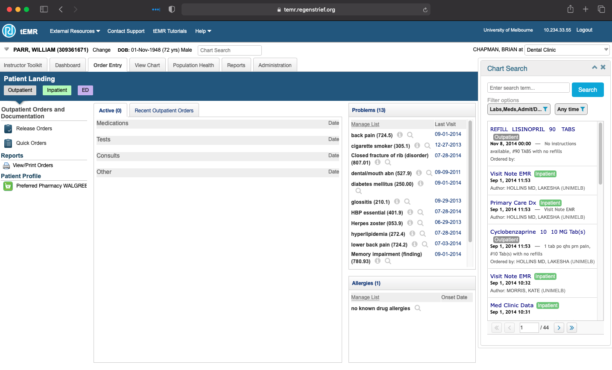
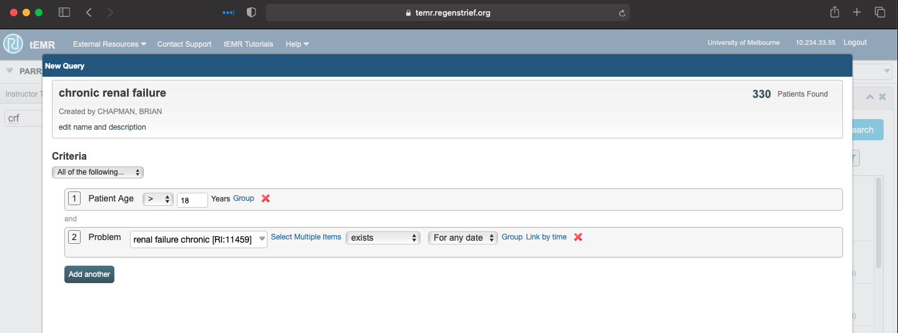
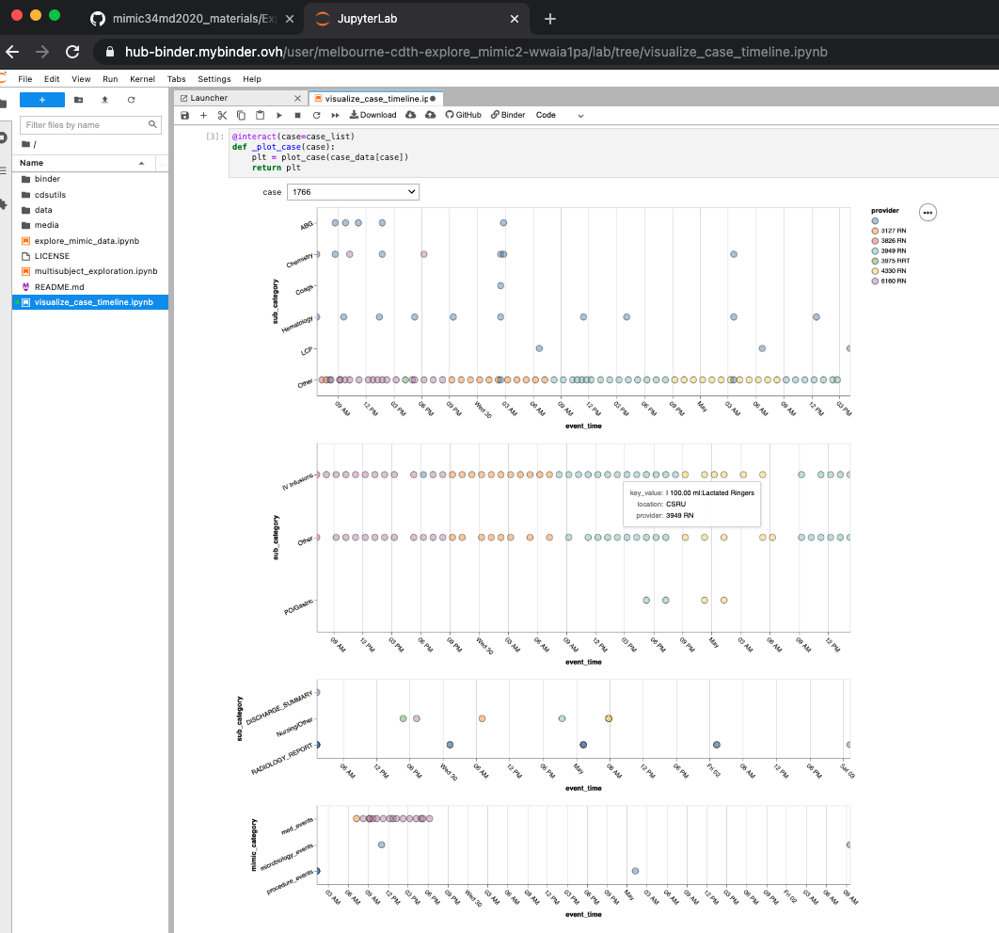
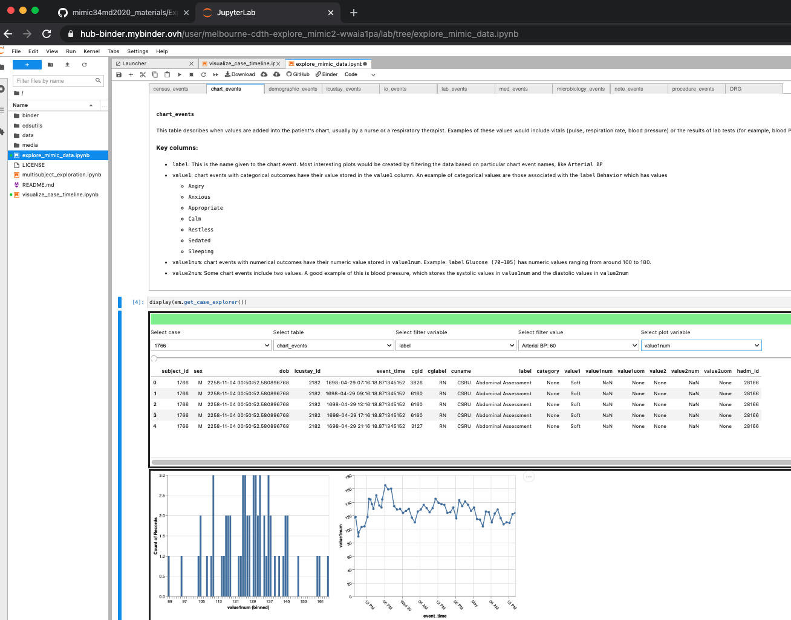
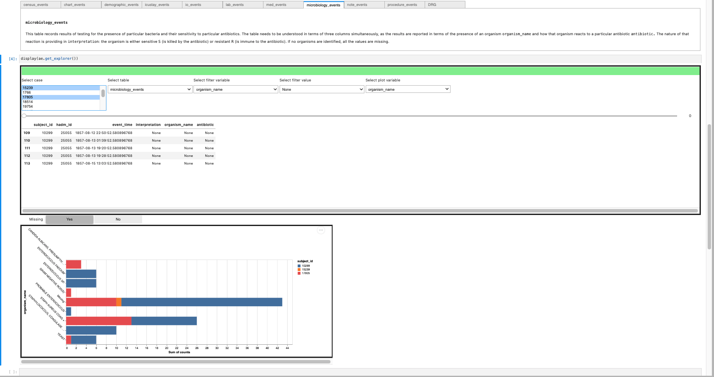
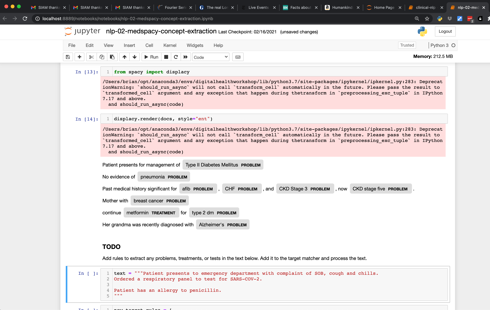

# Digital Health and the MD Curriculum

The Centre for the Digital Transformation of Health is working with partners throughout the university and the national and international community to create curricula for medical students that will allow the students to develop the skills and understanding to practice medicine and conduct research effectively in digitally connected health spaces.

The COVID-19 pandemic has both created the need for such experience in current education and highlighted the reality of the transforming healthcare environments. 

## What Has the CDTH Been Doing?

## Real-world EHR Training

- ~12k de-identified actual patient records
- Both in and out patient cases
- Clinically functional EMR created by Clem McDonald and Bill Tierney
- USA patients, but interface customizable to Australia (e.g. Australian drug formularies)
- Patient-level activities
   - Charting
   - Order entry
- Population-level activities
   - cohort identification
   - clinical decision support

## Interviews Regarding Informatics Experiences

<iframe width="560" height="315" src="https://www.youtube.com/embed/N-ZviegIGkE?start=2217" title="YouTube video player" frameborder="0" allow="accelerometer; autoplay; clipboard-write; encrypted-media; gyroscope; picture-in-picture" allowfullscreen></iframe>

<iframe width="560" height="315" src="https://www.youtube.com/embed/V-xnEmRpq_Y?start=1190" title="YouTube video player" frameborder="0" allow="accelerometer; autoplay; clipboard-write; encrypted-media; gyroscope; picture-in-picture" allowfullscreen></iframe>

## Data-Driven Research Experiences

### MIMIC34MD

- ICU Datamart created in collaboration between MIT and Beth-Israel Deaconess Hospital
- ~65k de-identified cases
- Available on Google BigQuery

#### Programming-free Exploration

#### Exploration of Documentation

