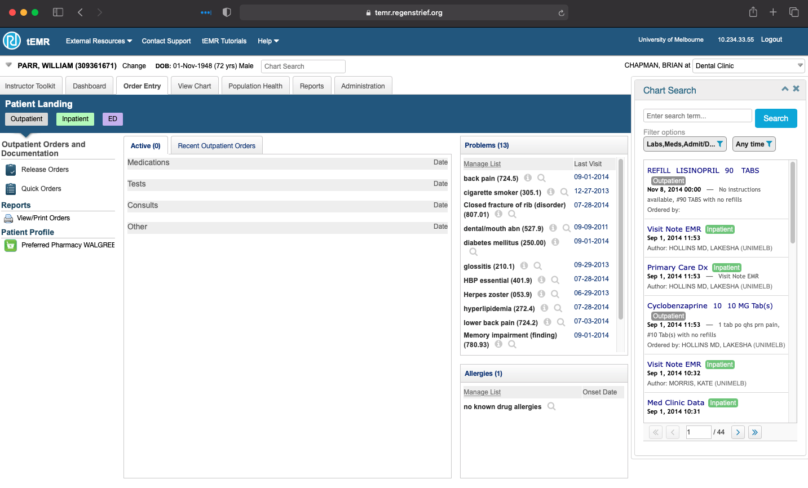
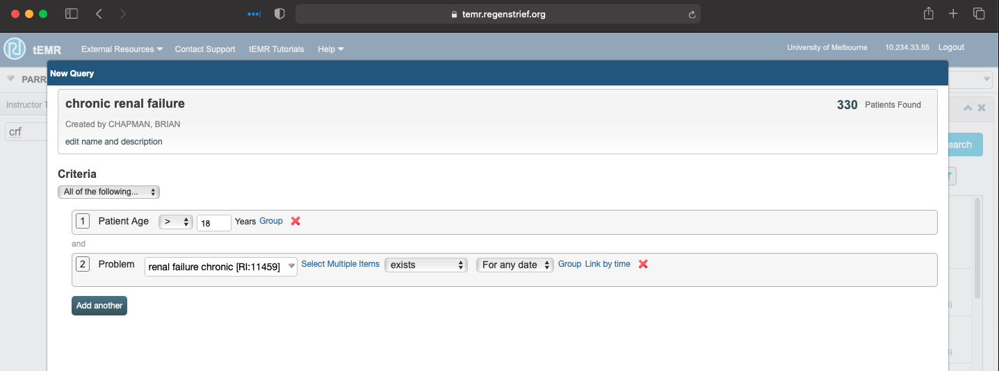
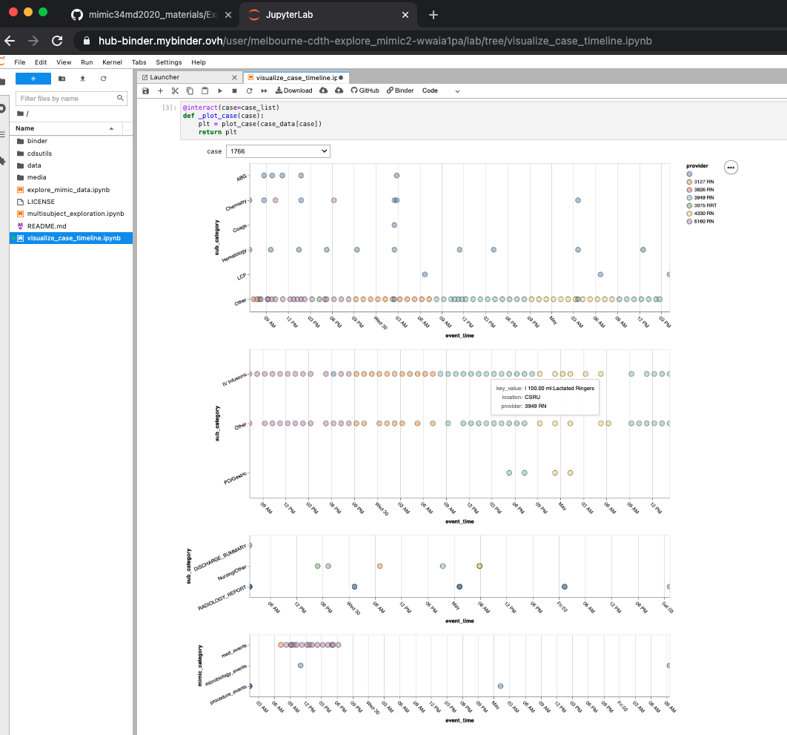
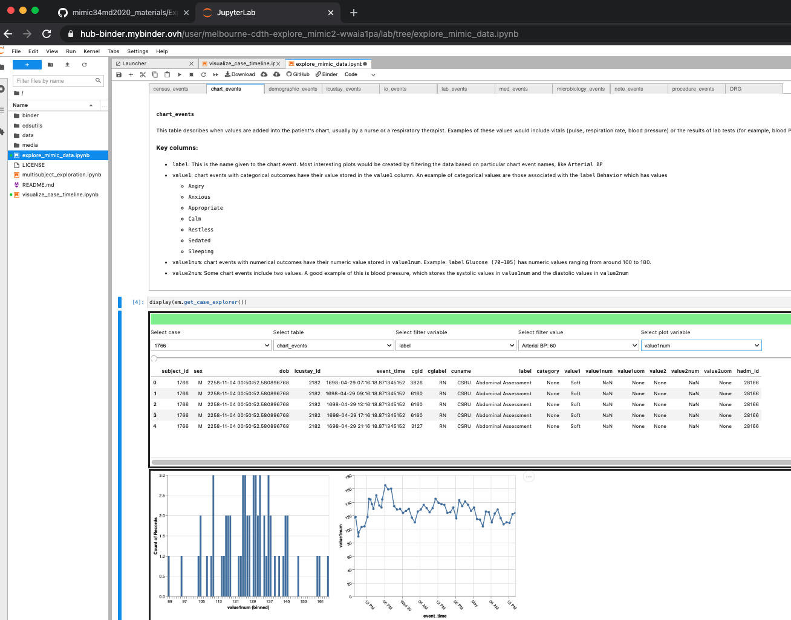
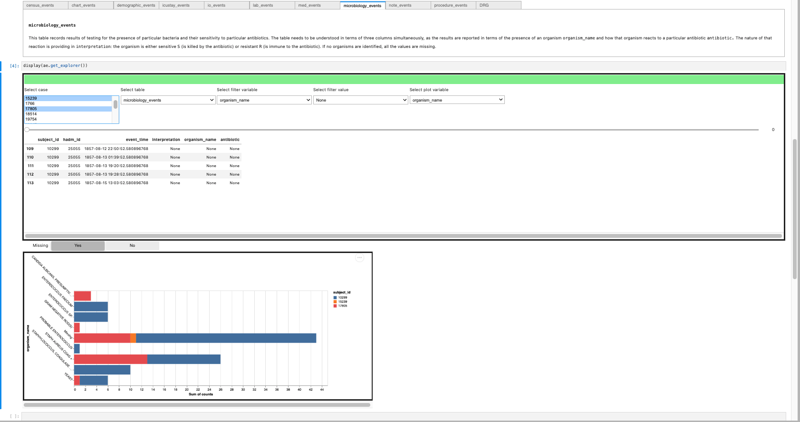
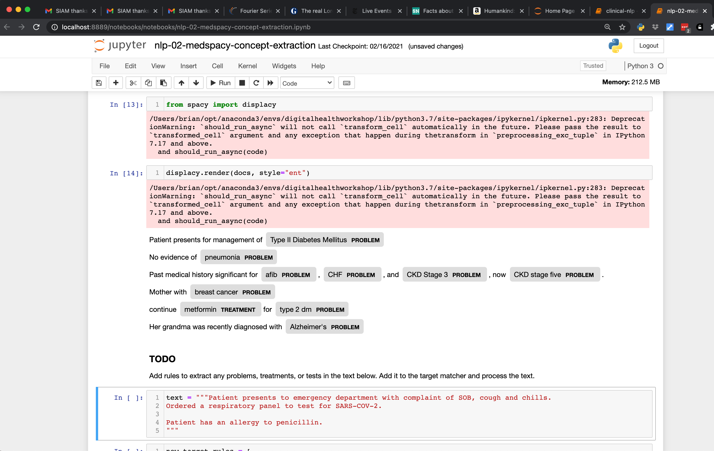

# Digital Health and the MD Curriculum

The Centre for the Digital Transformation of Health is working with partners throughout the university and the national and international community to create curricula for medical students that will allow the students to develop the skills and understanding to practice medicine and conduct research effectively in digitally connected health spaces.

The COVID-19 pandemic has both created the need for such experience in current education and highlighted the reality of the transforming healthcare environments.

## What Has the CDTH Been Doing?

We have been investing time and money into providing medical informatics and clinical data science resources that can be used online to help medical and other students learn and develop skills and insights related to informatics and digital health.

## Real-world EHR Training

One of the recognized needs for students is experience with electronic health records. For medical students, it is important that they learn how to find information and document care within an electronic medical record prior to arriving in the clinical setting. For graduate students EMR/EHR experience provides context as well as insight for future innovations.

While every major EHR vendor provides a training environment, these are not typically accessible to students. Consequently we have purchased a site license for the teaching Electronic Medical Record (tEMR) created at the Regenstrief Institute in Indiana, USA.

- ~12k de-identified actual patient records
- Both in and out patient cases
- Clinically functional EMR created by Clem McDonald and Bill Tierney
- USA patients, but interface customizable to Australia (e.g. Australian drug formularies)
- Patient-level activities
   - Charting
   - Order entry
- Population-level activities
   - cohort identification
   - clinical decision support

## Interviews Regarding Informatics Experiences

#### What should medical students know about informatics?

<iframe width="560" height="315" src="https://www.youtube.com/embed/652RmFCvV-w?start=1190" title="YouTube video player" frameborder="0" allow="accelerometer; autoplay; clipboard-write; encrypted-media; gyroscope; picture-in-picture" allowfullscreen></iframe>

#### How did the EHR contribute to learning COVID-19 guidelines?

<iframe width="560" height="315" src="https://www.youtube.com/embed/V-xnEmRpq_Y?start=1190" title="YouTube video player" frameborder="0" allow="accelerometer; autoplay; clipboard-write; encrypted-media; gyroscope; picture-in-picture" allowfullscreen></iframe>

#### How was the EHR used during the COVID-19 Pandemic?

<iframe width="560" height="315" src="https://www.youtube.com/embed/5xMUKy4z2vA?start=882" title="YouTube video player" frameborder="0" allow="accelerometer; autoplay; clipboard-write; encrypted-media; gyroscope; picture-in-picture" allowfullscreen></iframe>

## Data-Driven Research Experiences

We have been creating Jupyter notebooks that allow students to explore medical data. Jupyter notebooks allow data exploration and programming through a web browser. Coupled with cloud computing resources, Juptyer notebooks provide computational opportunities for students with the only requirement being a web browser.

### MIMIC34MD

#### Winter Break Short Course Option for MD1 Students

- ICU datamart created in collaboration between MIT and Beth-Israel Deaconess Hospital
- ~65k de-identified cases
- Available on Google BigQuery

#### Programming-free Exploration

You can try these yourself. Just click the __launch binder__ button:

__Patient Data Timeline__

In this exploration, you can see what kinds of data are being generated, when they are being generated, and who is generating/documenting the data. Because of the large amount of data being generated, the visualization makes use of hover tools to provide more information than can reasonably be displayed.

#### Exploration of Documentation

